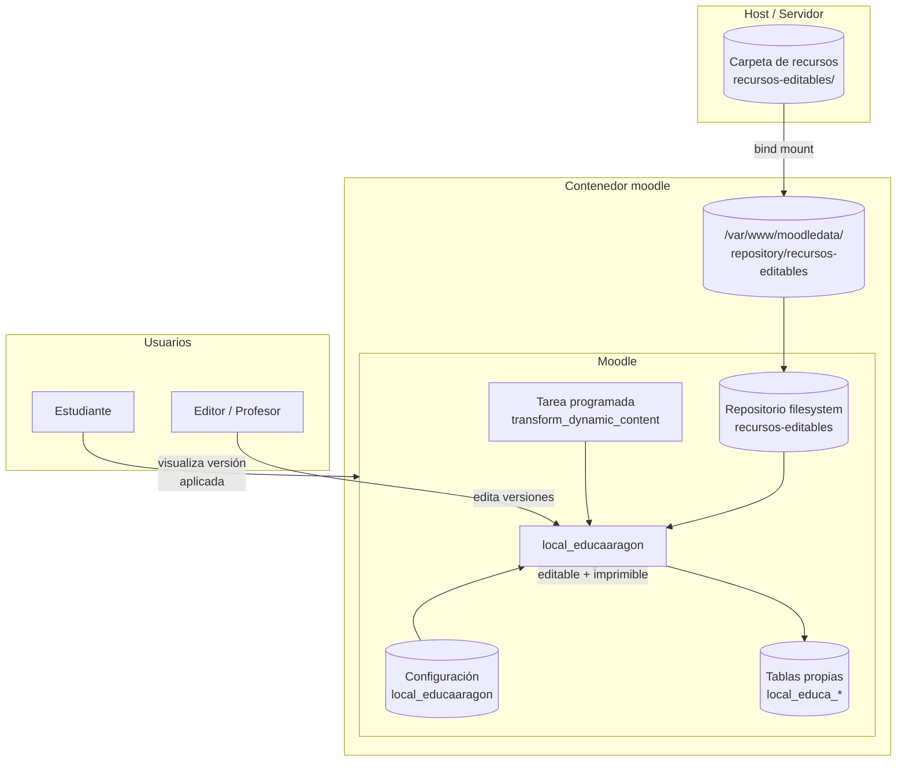
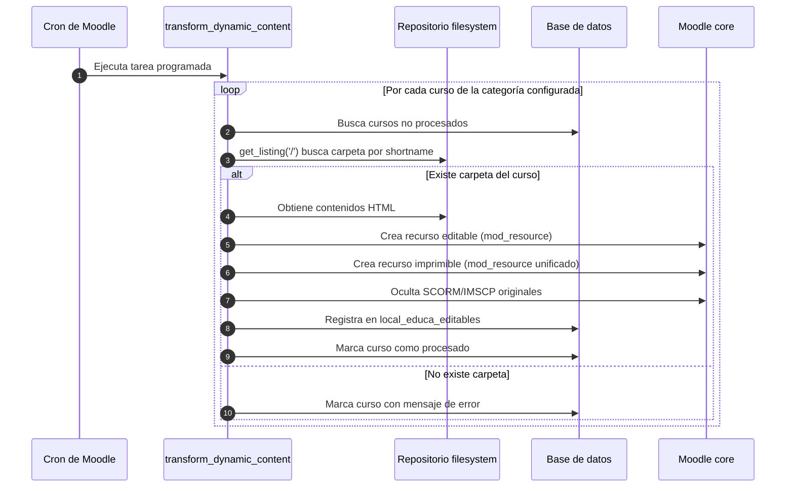
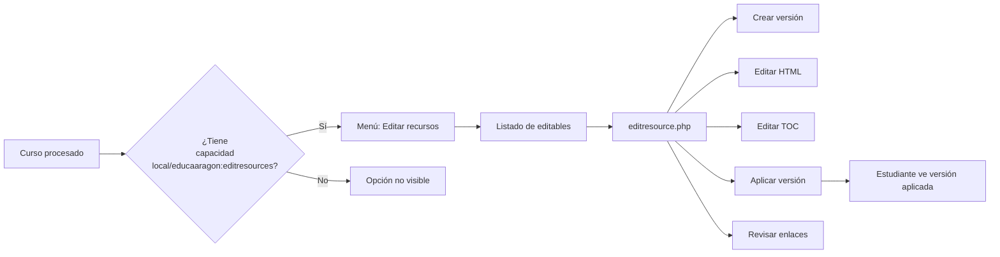
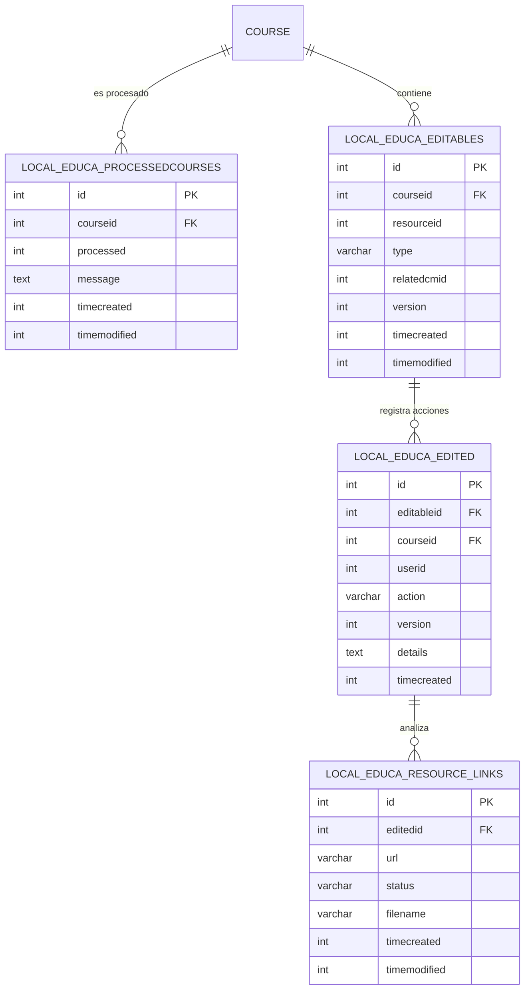
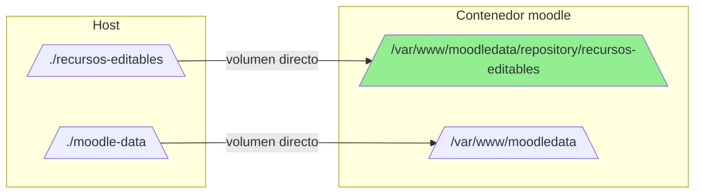

# local_educaaragon — Guía completa de desarrollo, usuario y operación

> Plugin Local de Moodle para la edición de materiales educativos (Educa Aragón).  
> Desarrollado por 3iPunt <https://www.tresipunt.com/>.

---

## Tabla de contenidos

1. [Resumen](#1-resumen)
2. [Requisitos previos](#2-requisitos-previos)
3. [Arquitectura del sistema](#3-arquitectura-del-sistema)
4. [Procedimiento de desarrollo](#4-procedimiento-de-desarrollo)
5. [Guía de usuario](#5-guía-de-usuario)
6. [Configuración en FPVirtual (Docker)](#6-configuración-en-fpvirtual-docker)
7. [Fallos comunes y soluciones](#7-fallos-comunes-y-soluciones)
8. [Referencia de archivos](#8-referencia-de-archivos)

---

## 1. Resumen

`local_educaaragon` transforma contenidos dinámicos de Moodle (SCORM e IMSCP) en recursos HTML editables, generando además una versión imprimible de cada recurso. Proporciona un sistema ligero de control de versiones que permite a los editores:

- Modificar el HTML de los materiales.
- Editar la tabla de contenidos (TOC).
- Crear versiones a partir de otras.
- Aplicar una versión para que sea visible por los estudiantes.
- Revisar enlaces rotos.

Todo el procesado pesado se realiza mediante una **tarea programada de Moodle** que se ejecuta por defecto a las 03:00 h.

---

## 2. Requisitos previos

### 2.1 Requisitos de Moodle

| Componente | Versión / Configuración |
|------------|-------------------------|
| Moodle | ≥ 4.1 (`2022112811`) |
| PHP | 7.4+ (el proyecto FPVirtual usa 8.2) |
| Cron | Ejecución periódica recomendada (30 s – 1 min) |
| Repositorio | **Filesystem** configurado y visible |

### 2.2 Estructura de carpetas esperada

El plugin lee los materiales desde el repositorio filesystem. Dentro del repositorio, espera encontrar una carpeta por curso, cuyo nombre coincida con el `shortname` del curso:

```text
moodledata/repository/<repo>/
└── <shortname_curso>/
    ├── index.html
    ├── 01.html
    ├── 02.html
    └── ...
```

Las ediciones y versiones generadas se almacenan en:

```text
moodledata/repository/<repo>/editions/
└── <shortname_curso>/
    └── <resourceid>/
        ├── original/
        ├── version_1/
        ├── version_2/
        └── ...
```

---

## 3. Arquitectura del sistema

### 3.1 Diagrama general de componentes



### 3.2 Flujo de transformación inicial (tarea programada)



### 3.3 Flujo de edición de un recurso



### 3.4 Modelo de datos



### 3.5 Arquitectura de montaje en Docker



> **Importante**: el montaje directo evita el uso de enlaces simbólicos. Ver [Fallo del symlink](#72-fallo-del-enlace-simbólico-absoluto).

---

## 4. Procedimiento de desarrollo

### 4.1 Instalación del plugin en desarrollo

1. Clonar el repositorio del plugin dentro del código de Moodle:

   ```bash
   cd /var/www/html/local
   git clone https://github.com/FPVirtual/fp-virtual-plugin-edicion-materiales.git educaaragon
   cd educaaragon
   git checkout main
   ```

2. Acceder a `Administración del sitio` en Moodle para completar la instalación (crea tablas, servicios, eventos y tarea programada).

3. Configurar el repositorio filesystem y el plugin (ver [Configuración manual](#configuracion-manual)).

### 4.2 Compilación de assets JavaScript

El plugin usa módulos AMD en `amd/src/`. Para compilarlos a `amd/build/`:

```bash
cd /var/www/html
grunt amd --root=local/educaaragon
```

> Requiere tener instaladas las herramientas de desarrollo de Moodle (`npm install` en la raíz de Moodle).

### 4.3 Estructura de clases relevantes

| Archivo | Responsabilidad |
|---------|-----------------|
| `classes/processcourse.php` | Transformación SCORM/IMSCP → HTML + imprimible |
| `classes/manage_editable_resource.php` | Gestión de versiones, archivos y aplicación |
| `classes/task/transform_dynamic_content.php` | Tarea programada |
| `classes/external/*.php` | Servicios web AJAX |
| `settings.php` | Página de configuración del plugin |
| `lib.php` | Funciones helper (`get_repository`, `copy_folder`, etc.) |

### 4.4 Convenciones

- **Namespaces**: `local_educaaragon\`, `local_educaaragon\external\`, `local_educaaragon\output\`, `local_educaaragon\task\`.
- **Idioma**: español como idioma principal (`lang/es/local_educaaragon.php`).
- **Codificación**: UTF-8. Usar `libxml_use_internal_errors(true)` al manipular `DOMDocument`.
- **Strings**: todas las cadenas visibles deben definirse en los archivos de idioma.

---

## 5. Guía de usuario

### 5.1 Requisitos para editar

El usuario debe tener la capacidad `local/educaaragon:editresources` en el curso. Normalmente se asigna a los roles de **profesor** y **profesor sin permiso de edición**.

### 5.2 Procesar un curso por primera vez

1. Asegurarse de que el curso tiene un `shortname` válido.
2. Colocar los archivos HTML del material en:
   `moodledata/repository/<repo>/<shortname_curso>/`.
3. Esperar a que se ejecute la tarea programada (todos los días a las 03:00 h) o forzar la ejecución:

   ```bash
   php admin/tool/task/cli/schedule_task.php \
       --execute='\\local_educaaragon\\task\\transform_dynamic_content' \
       --showdebugging
   ```

4. Acceder al curso. Si el procesado fue correcto, aparecerá la opción **Editar recursos** en el menú del curso.

### 5.3 Editar un recurso

1. Dentro del curso, ir a **Editar recursos**.
2. Seleccionar el recurso a editar.
3. Desde la interfaz se puede:
   - **Crear versión**: genera una copia editable a partir de la versión actual.
   - **Editar HTML**: modificar archivos individuales con Atto.
   - **Editar TOC**: reorganizar la tabla de contenidos con drag & drop.
   - **Guardar cambios**: persistir la versión editada.
   - **Aplicar versión**: hacer visible esa versión para los estudiantes.
   - **Revisar enlaces**: detectar enlaces rotos en la versión.

### 5.4 Versiones

- La versión `original` es la copia inicial del material y **no se puede editar ni eliminar**.
- Se pueden crear tantas versiones como sea necesario.
- Solo una versión aplicada es la que ven los estudiantes.

---

## 6. Configuración en FPVirtual (Docker)

### 6.1 Configuración automática (recomendada)

En el proyecto `Moodle-Docker` la configuración se realiza automáticamente durante la instalación mediante el script `init-scripts/new-install/educaaragon_setup.php`.

Pasos:

1. Definir la variable en `.env`:

   ```bash
   EDUCAARAGON_RESOURCES_PATH=./recursos-editables
   ```

2. El `docker-compose.yml` monta automáticamente el volumen:

   ```yaml
   volumes:
     - ./moodle-data:/var/www/moodledata
     - ${EDUCAARAGON_RESOURCES_PATH:-./recursos-editables}:/var/www/moodledata/repository/recursos-editables
   ```

3. Durante el primer arranque, `init.sh` ejecuta `plugins.sh`, que llama a `educaaragon_setup.php`. Este script:
   - Activa el tipo de repositorio filesystem.
   - Crea la instancia del repositorio apuntando a `recursos-editables`.
   - Configura `local_educaaragon/repository`, `/activetask` y `/allcourses`.

### 6.2 Configuración manual

Si Moodle ya está instalado y no se ejecutaron los scripts de `new-install`:

```bash
docker compose exec moodle php /init-scripts/new-install/educaaragon_setup.php
```

### 6.3 Verificación

```bash
docker compose exec moodle php -r "
define('CLI_SCRIPT', true);
require('/var/www/html/config.php');
require_once(\$CFG->dirroot . '/repository/lib.php');
\$instances = repository::get_instances(['type' => 'filesystem']);
echo 'Instancias filesystem: ' . count(\$instances) . PHP_EOL;
foreach (\$instances as \$i) {
    echo '  - ID: ' . \$i->id . ' Nombre: ' . \$i->name . ' Path: ' . \$i->get_option('fs_path') . PHP_EOL;
}
echo 'repository: ' . get_config('local_educaaragon', 'repository') . PHP_EOL;
echo 'activetask: ' . get_config('local_educaaragon', 'activetask') . PHP_EOL;
echo 'allcourses: ' . get_config('local_educaaragon', 'allcourses') . PHP_EOL;
"
```

Salida esperada:

```text
Instancias filesystem: 1
  - ID: X Nombre: Recursos Editables Path: recursos-editables
repository: X
activetask: 1
allcourses: 1
```

---

## 7. Fallos comunes y soluciones

### 7.1 Fallo del enlace simbólico absoluto

#### Síntoma

Dentro del contenedor Moodle no puede acceder a los recursos editables. Mensajes como:

```text
The instance is not properly configured, invalid path
```

#### Causa

Dentro de `moodle-data/repository/` existe un enlace simbólico absoluto creado en el host:

```text
recursos-editables -> /apps/8087-moodle-mariadb-docker/recursos-editables
```

Esa ruta existe en el host pero **no dentro del contenedor**. Docker no traduce las rutas absolutas de los symlinks al cruzar el límite del contenedor.

#### Solución recomendada (mover la carpeta dentro de moodledata)

En el host:

```bash
cd /apps/8087-moodle-mariadb-docker/moodle-data/repository/
rm recursos-editables
mv /apps/8087-moodle-mariadb-docker/recursos-editables ./recursos-editables
chown -R www-data:www-data recursos-editables
```

Reiniciar el contenedor:

```bash
docker compose down
docker compose up -d
```

#### Solución alternativa (mantener fuera y montar vía Docker)

Añadir un volumen adicional en `docker-compose.yml`:

```yaml
services:
  moodle:
    volumes:
      - /apps/8087-moodle-mariadb-docker/moodle-data:/var/www/moodledata
      - /apps/8087-moodle-mariadb-docker/recursos-editables:/apps/8087-moodle-mariadb-docker/recursos-editables:ro
```

> Nota: la solución recomendada es no depender de symlinks y usar el bind mount directo que ya incluye el proyecto.

### 7.2 Error `Undefined constant "REPOSITORY_INSTANCE_VISIBLE"`

#### Síntoma

Al ejecutar `educaaragon_setup.php`:

```text
!!! Excepción - Undefined constant "REPOSITORY_INSTANCE_VISIBLE" !!!
```

#### Causa

Versiones antiguas del script usaban una constante que no existe en Moodle 4.5.

#### Solución

Actualizar `educaaragon_setup.php` para usar un booleano:

```php
$type->update_visibility(true);
```

### 7.3 El plugin no aparece en el menú del curso

#### Causas posibles

1. El curso no ha sido procesado por la tarea programada.
2. El usuario no tiene la capacidad `local/educaaragon:editresources`.
3. No existen recursos editables para el curso.

#### Soluciones

1. Forzar la ejecución de la tarea programada.
2. Revisar roles y permisos del usuario en el curso.
3. Verificar que en `moodledata/repository/<repo>/` exista una carpeta con el `shortname` exacto del curso.

### 7.4 No se crean recursos editables/imprimibles

#### Causas posibles

- No existe `index.html` en la carpeta del curso.
- Los nombres de los archivos HTML no coinciden con el orden esperado por `processcourse.php`.
- El curso no tiene módulos SCORM/IMSCP (la tarea busca estos tipos).

#### Soluciones

- Asegurar que haya un `index.html`.
- Revisar los logs de la tarea programada para ver mensajes de error detallados.
- Verificar que el `shortname` del curso coincida exactamente con el nombre de la carpeta en el repositorio.

### 7.5 La tarea programada no se ejecuta

#### Solución

1. Verificar que el cron de Moodle esté configurado y corriendo.
2. Revisar `Administración del sitio → Servidor → Tareas programadas → Transform dynamic content`.
3. Ejecutar manualmente para depurar:

   ```bash
   php admin/tool/task/cli/schedule_task.php \
       --execute='\\local_educaaragon\\task\\transform_dynamic_content' \
       --showdebugging
   ```

---

## 8. Referencia de archivos

### 8.1 En el plugin

```text
local/educaaragon/
├── version.php
├── lib.php
├── settings.php
├── editables.php
├── editresource.php
├── editresourcetoc.php
├── processedcourses.php
├── registereditions.php
├── resourcelinks.php
├── db/
│   ├── install.xml
│   ├── upgrade.php
│   ├── access.php
│   ├── services.php
│   ├── events.php
│   └── tasks.php
├── classes/
│   ├── processcourse.php
│   ├── manage_editable_resource.php
│   ├── manage_logs.php
│   ├── eventobservers.php
│   ├── educa_*.php
│   ├── task/transform_dynamic_content.php
│   └── external/*.php
├── amd/src/
│   ├── editresource.js
│   ├── edittoc.js
│   └── processedcourses_page.js
├── templates/
└── lang/
    ├── es/local_educaaragon.php
    └── en/local_educaaragon.php
```

### 8.2 En el proyecto FPVirtual

| Archivo | Propósito |
|---------|-----------|
| `.env.example` | Define `EDUCAARAGON_RESOURCES_PATH` y `PLUGIN_LOCAL_EDUCAARAGON` |
| `docker-compose.yml` | Monta `recursos-editables` en `/var/www/moodledata/repository/recursos-editables` |
| `plugins.json` | Catálogo del plugin con `default_enabled: true` |
| `init-scripts/new-install/plugins.sh` | Llama a `educaaragon_setup.php` |
| `init-scripts/new-install/educaaragon_setup.php` | Configura automáticamente el repositorio y el plugin |

---

## Historial de cambios

| Fecha | Cambio |
|-------|--------|
| 2026-05-29 | Creación de la guía con arquitectura, desarrollo, usuario, Docker y fallos. |
